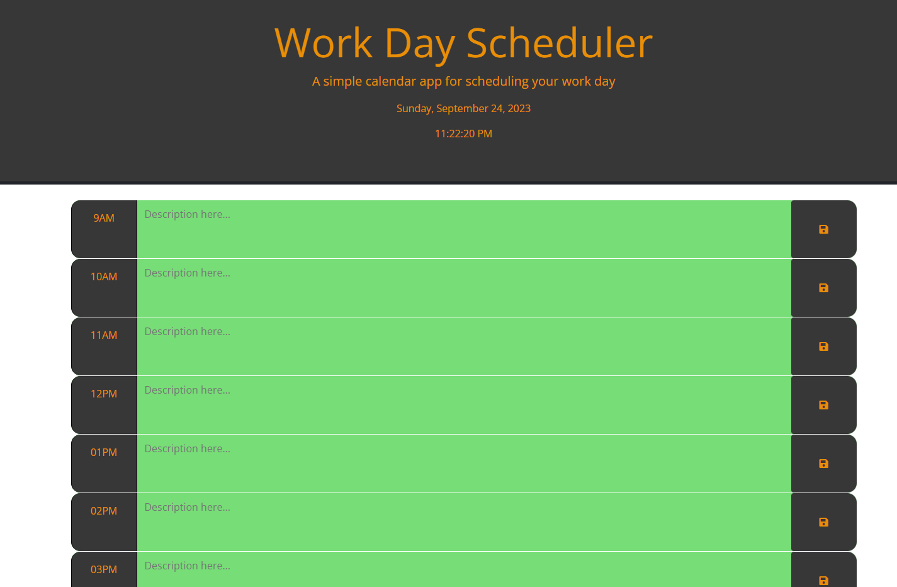
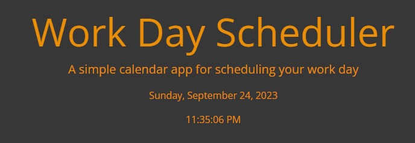
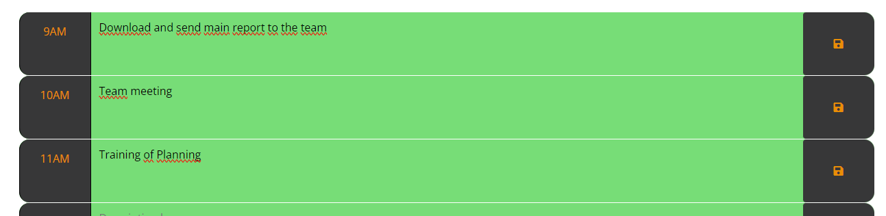
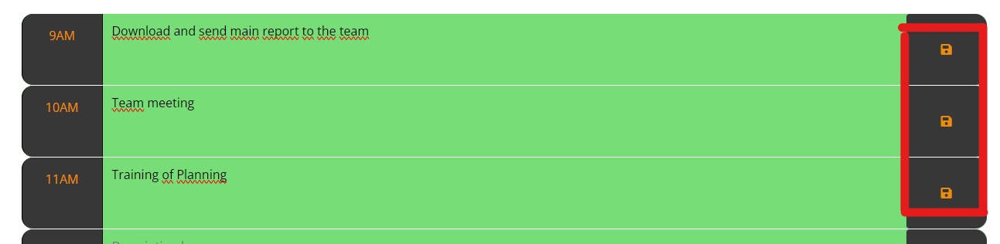

# Timed Quiz

## Description

This is the Timed Quiz app, when you can play and answer some questions about basic javascript.

You will have a timer with 60 seconds to answer 5 questions. If you choose a wrong answer, the timer will subtract 10 seconds and if you dont have seconds, the game will be end.

Start to Play and let us know how is your JS knowledge!

## Technologies

- HTML5
- CSS3
- JavaScript

## Usage

Open deployed app at https://andedu15.github.io/timedQuiz/

 - Click on "Start Quiz" button.

 - You will see a timer and the first question.

 

 - Choose your answer. After your selection, you will see the correct answer (green) and wrong answer (red).

 

 - If you selected a wrong asnwer, timer will subtract 10 seconds.
 - If you dont have seconds on the timer, the game will end and you will see your score.
 - You need to write your initials on the score windows.

 

 - You will see the high score table, and you can play again to get a new score or delete the score saved.

 

## Screenshot

Main card

