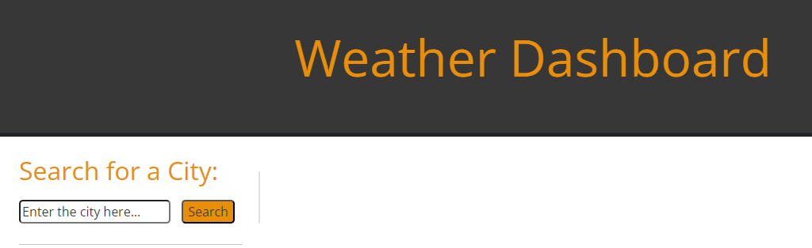

# Weather Dashboard

## Description

This is the Weather Dashboard app, where you will can get the current weather information of you selected city.

You will get the date, current temperature, speed wind, humidity percentage.

## Technologies

- HTML5
- CSS3
- JavaScript
- Open Weather API

## Usage

- Open deployed application: https://andedu15.github.io/weatherDashboard/

- Write the city you need to know the weather.

- Hit Search button.

- You will see the result of your city in a square (temp, wind, humidity).

- You can write anothers cities.

- You will have your search history.

## Screenshot

- Main card

